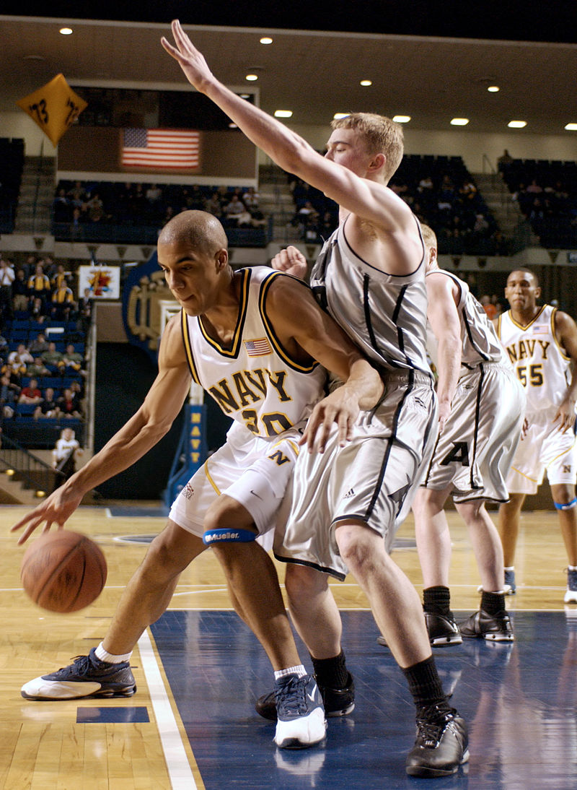

Co(re)creation: designing the next civic hack
---

/ dribdat collective // v.2.3 /// 1.2022

This paper describes an open source tool that is used to manage challenges, resources and bootstraps, build teams,and promote fair conditions at hackathons in a simple user interface. Learn how **dribdat** is used to run hackathons, track team progress, expose all relevant design notes, documentation, data, and code, and to connect the many aspects of the experience of exploring civic tech problems together hands-on.

This open document is accessible at dribdat.cc/whitepaper

1. [Executive summary](#summary)
2. [Splendid collaboration](#collaboration)
3. [Connection to results](#results)
4. [Reducing friction](#friction)
5. [Assuring interoperability](#interoperability)
6. [Being excellent to each other](#excellent)
7. [Not being all the things](#things)
8. [Always be closing](#closing)
9. [References](#references)

---

# ➀ executive summary

Using dribdat, we develop and showcase projects at collaborative events, most commonly at hackathons: a popular event format for tinkering and innovation in teams. Emerging from the civic tech movement, where open access to data and knowledge is applied to hold public institutions accountable, dribdat started as a tool for organisers and participants. We created dribdat to ensure that people's contributions are verifiable,and that the 'executive summary' of their output gets published using modern web standards, to be ideally discoverable, readable and reproducible.

Hackathons are also considered to be a type of focus group, where platforms get tested, skills transferred, and horizontal insights accelerated by an open exchange of knowledge. This is an established venue to network, explore potential career paths while keenly evaluating prospective candidates or partners. Enabling better time management and coordination, teamwork supported by dribdat should help to build a community of practice, lowering the barriers to entry for contributing creatively to NGOs, research, government, tech platforms or start-ups.

When citizens engage to hack on projects such as monitoring the environment or validating public accounts,digital civil society initiatives emerge. The shared premise is that open source code and openly designed hardware can be used to rapidly prototype the real-world potential and impact of ideas or "challenges". Such events are then more than just a trendy way to find a job: they become venues for energetic collaboration, channelling civic engagement and technical experiments within an open, socialised setting. In contributing to such events,the participants engage to intensively generate data, take opportunities to be active for diverse causes in pragmatic ways. It is important that the platform they use reflects these purposes in its construction and philosophy.

With the experience of organising many such meetings with other tools, including wikis, collaboration platforms, and other hackathon software, we are using dribdat today to streamline efforts and encode best practices across many communities.The name of dribdat is inspired by *dribbling* in basketball and other sports, with a hat tip to [Dribbble](https://dribbble.com/), an online community for graphic design, and the [Dat protocol](https://datproject.org/) for peer-to-peer data sharing.

In the following sections we dive deeper into what exactly makes dribdat tick.

_Graph of contributions to the dribdat code base, via GitHub_

_[U.S. Navy photo](http://www.news.navy.mil/view_single.asp?id=11704) by Photographer's Mate 2nd Class [Damon J. Moritz](https://commons.wikimedia.org/w/index.php?curid=45208) - Public Domain_

---

 # ➁ splendid collaboration
 
Designed to help participants and organisers to have a great time and focus on the essentials, dribdat features timekeeping and progress tracking dashboards to make it easier to form teams, sustain the energy in the room or online event,  and  keep  the focus on driving ideas forward.

The open source code of dribdat is accessible for free (under the MIT license), with instructions for self-hosting the platform anywhere that Python runs - which is, basically, anywhere. We are making it easier to deploy on popular platforms using package management and containers. With a running application, you can set up your first hackathon. Future events can run on the same site.

On the front page you can see the featured upcoming event, as well as any future and past events. A short description is followed by a link to the event home page, as well as a second-by-second countdown of time remaining until the start or the finish line (once started). *Projects*, *Challenges* and *Resources* are shown in the event screen. Here you can learn about topics, find datasets, get schedules or directions, and any other vital information that the organisers have provided.

Before the event begins it is possible to *Share a challenge*, which can be organised by *Category*. People who are interested in a challenge can approach the initiator in person or via contact channels to express their support. Once the event has started, you can form a team by clicking the *Join* button, taking over a challenge and boosting it, or selecting *Start project* to begin afresh when open challenges are permitted. The dribdat dashboard helps to keep track of remaining time for your all your registered teams.

---

# ③ connection to results

Open web technologies and open data standards are at the core of dribdat. The teams are free to work as they please: keeping up with every twist and turn in the online collaboration landscape, we try to nurture supportive communities sharing the best brainstorming, prototyping and code sharing tools, helping to ensure we can plug in and generate data from any preferred platforms.

Typically, hackathons need some kind of publishing workflow that collects data from the team in a series of forms. We have often encountered this to be a laborious process that steals valuable time from teams and organisers while introducing bias and latency. Project aggregation is facilitated by the ability to start a project on the basis of data from a coding platform, a chat channel, or an open web resource.

No 'copypasta' needed: projects created in a compatible repository - such as [GitHub](http://github.com/), [GitLab](http://gitlab.com/),[Bitbucket](http://bitbucket.com/) - or supported wikis, such as [Etherpad](http://etherpad.org/), [DokuWiki](https://www.dokuwiki.org/), [Google Docs](https://www.google.com/docs/about/), ... - can be synchronised so that documentation can take place, and *continue to happen in a distributed way*, using standard formats, such as the *README* files preferred in open source.

**💡** Users may also use short Twitter-like posts with [Markdown](https://en.wikipedia.org/wiki/Markdown) formatting, assisted by a rich text editor, to document their project, and we are working on simpler, more direct ways to capture insight into participant activity. This includes [dridbot](https://github.com/hackathons-ftw/dridbot#dridbot), a chat-mode integration (for example for Slack or RocketChat) that allows updating projects directly within a team channel.

\
Swiss BroadcastingCorporation / [#swihack 2020](https://swihack.ch/)

\
Opendata.ch / [Open Farming Hackdays 2021](https://hack.farming.opendata.ch/event/1)

---

# ④ reducing friction

Project presentations and demos made easily and efficiently available for evaluation when each team can update their own progress level, generating an automatic metric for profile completeness and activity levels, and giving each project a meaningful progress score.

Participants can subscribe to a challenge or join a project once someone has started it, and immediately gain access to improving the content. Their public profile gets linked to the project, and their activities -- posted messages (also known as "dribs"), progress reports, code commits, etc. -- can all be tracked alongside those of their team-members in the project's log. Only be engaging in this way can their team climb through the normalizing progress stages of the event.

This kind of tooling has potential to be used in a variety of formats --from Agile Scrum sprints, to Design Thinking workshops and Rapid Prototyping: everywhere that time is of the essence, and a scrappy, "can-do" attitude reflective of the hacker ethic encourages better results, while enabling more venues for civic hacking and open data sharing. 

We are working to build dribdat into a powerful tool for tracking performance and recognising contribution -- for example, by supporting real-time collaboration in [CodiMD](https://github.com/hackmdio/codimd) and [Jupyter](https://jupyter.org/) notebooks embedded directly in the project, to minimise the friction of on-boarding contributors.

**💡** We support several ways of extracting real-time statistics for insight on the pulse of the hackathon, pointing to improvements and providing motivational data-points as content. 

The data exports, APIs, and dashboards of dribdat allow organisers to at a glance see how all their teams rank both during and after the event. Fundamental to this is the experience of the hackathon participant, their ability to represent their team, to be aware of what's happening in the wider event, document their efforts, and present the results on time.

\
Opendata.ch / [Energy Data Hackdays 2020](https://hack.opendata.ch/project/463)

---

# ⑤ assuring interoperability

This is not just a metaphor: this platform is a digital glue between a plethora of tools and processes that are being deployed in the civic tech community, enabling quick and painless deployment and support of hackathons. Tools like dribdat are important instruments in facilitating concentrated social change-making that is digitally sustainable.

Several innovations on this level are baked into the core of dribdat: support for Frictionless Data, the "open-source toolkit that brings simplicity and gracefulness to the data experience" ([frictionlessdata.io](https://frictionlessdata.io/)) which we use to accelerate the process of unpacking and exploring open information sources in the crucial early research & experimentation phases of a hackathon.

We have created and promoted an open schema for publishing hackathon results: hackathon.json- a simple, readable text file at the root of any dribdat instance. Along with Data Package export, and compliance for [S](https://schema.org/Hackathon)[chema.org](https://schema.org/Hackathon) and [Open Graph](https://ogp.me/) standards, we strive to ensure that hackathon publications are picked up by search crawlers and easily federated.

For event organizers, our backend allows quick browsing and export of project data: in document form for evaluation by jury, or in CSV or JSON formats for external workflow. Spammy or invalid entries can be easily hidden or cleaned up. With OAuth 2 support, user profile administration can go through an external, enterprise-scale provider such as GitHub or Slack. 

**💡** We can generally support integration with any kind of data platform or collaboration tool through embedding or APIs. We can work with event management software, even other hackathon platforms, if you need to mix and match features: dribdat is intended to be part of an ecosystem of compatible Internet tools.

\
Forum Helveticum / [Plurilingualism Hackathon 2018](https://hack.opendata.ch/event/22)

---

# ⑥ being excellent to each other

This  project was built in the tradition  of creative and ethical hacking. We combined best practices in using wikis, issue tracking, and content management systems, and created the basic framework of the application at a hackathon in 2015. Since then, we have battle-tested it at many events with thousands of people. And the people have spoken to us about what they want from the experience.

In the first years of service, dribdat has supported dozens of events around Switzerland, becoming the official hackathon platform of the Swiss chapter of Open Knowledge and its working groups, the Open Network Infrastructure Association, DINAcon - the largest annual Swiss conference for digital sustainability, DayOne - an association organising patient-centric Health Hacks, and other valued pioneers.

One of the most important areas of feedback from our participants has been to understand what information should be made as visible as possible, to benefit our users despite the time pressure: these are a clear and readable Code of Conduct, Terms of Participation, and starter guides. Right out of the box, dribdat comes with support for the [Hack Code of Conduct](https://hackcodeofconduct.org/) and [Creative Commons](http://creativecommons.org/) licenses. 

**💡** We have built in a 7-step process inspired by the [School of Data Pipeline](https://schoolofdata.org/methodology/), that we recommend for attractive and efficient data expeditions and hackathons. Around these it is possible to set up a Resource area with recommended tools, datasets, or brainstorming instruments, and all the content can be customized to fit other patterns and methods.

Independently developed at the grassroots, behind the scenes of this project are compacted qualities of what we believe entails good collaboration: a supportive atmosphere that proliferates diversity and tolerance, clearly stated goals, community support and progressive guidelines. Inclusive co-creation  with better design and algorithms is an area of active development, currently the focus of research collaborations, upcoming publications, and development proposals.

\
The standard footer deployed with a dribdat instance.

\
Open Network Infrastructure Association / [MakeZurich](https://makezurich.ch/)

---

# ⑦ not being all the things

This is a niche product with unique features and clear limitations. While you will find a variety of enhancements being worked on in our Issue Tracker, here are a couple of major areas where we are lagging. Visit [awesome-hackathons](https://github.com/hackathons-ftw/awesome-hackathon)for similar products that you may wish to consider for your needs, and our [Open Collective](https://opencollective.com/dribdat) to discover a number of ways to support our project.

Dribdat has a minimal built-in **user profile**, allowing the use of an anonymous username and disposable e-mail address to log in. Collecting personally identifiable information is not the goal of the project: facilitating recognition in a privacy-protecting way is. We have OAuth support and suggest using tools like Slack or GitHub for managing user authentication, or asking users to create profiles in the community platform that you integrate with dribdat - like the open source Discourse forum software. You could also recommend "CV builder" platforms like LinkedIn or Stack Overflow to conveniently promote everyone's hackathon experiences. Nevertheless, the ability to display people's accomplishments in an interesting way remains an area of improvement.

Dribdat does not feature a **form builder**. We have left the project structure open ended, allowing operators and teams to define how people can engage as contributors or testers. This is certainly part of the challenge of succeeding with promoting a hackathon idea, but also a major area of improvement to assist beginners and encourage active participation through questionnaires and templates.While it is possible to include this in the "Getting Started" guide shown to teams, we are working on designs for enhancing this, as we see many organisers set up separate online forms for registration, collecting feedback, or asking specific questions to the teams.

**💡** At some hackathons, like the [hacknight challenge](https://hacknight.dinacon.ch/project/10) pictured here, we follow an easy-moderate-advanced structure ("ski pistes") in their task descriptions. Other eve nts set up a template which forces project teams to think about this issue.

While featuring a robust and mobile-ready user interface, the overall **User Experience** is rather underwhelming. Our project has not yet the benefit of a dedicated effort in UX engineering, and at the moment caters perhaps more to the needs of organizers who wish to facilitate a smooth event, than to the more diverse needs of hackathon participants. If it is to be desired that an application is more in the foreground and engaged with by users, then it needs to be an enjoyable and mutually beneficial process. We have started the [backboard](https://github.com/dribdat/backboard) project in response to requests for a smoother user interface for participants, based on a next-generation client/server [architecture](https://github.com/dribdat/design/blob/master/Technical%20guide%20final.pdf) developed by a student group, and aim to make progress on this soon.

In running hackathons, we are used to relying on a bunch of **complementary tools**. The organizing teams often use spreadsheets and calendars to make drafts and detailed plans. Clearly, the goal should not be to replace all of this with a new "[15th competing standard](https://xkcd.com/927/)", and integration with wikis and docs is already at the heart of the offering. The issue is focusing on the core needs and fitting dribdat correctly as a part of the workflow. Charting this and making sense of priorities is an effort started with several organizations to try to nail down a product strategy for dribdat.

At this time, **commercial support**for dribdat is an issue. The code base has developed organically using crowdsourced requirements. So far there is no broadly available Platform as a Service or a service provider running instances on demand. We believe there is a market for this and are happy to talk to any IT company who would be willing to put some thought into this. We are also connected to newer attempts to build a scalable operating system for hackathons, such as through [VersusVirus](https://app.versusvirus.ch/submissions/). While setting up a small dribdat instance is easy and should be enough for a few teams to getting started, the organizers of large events typically rely on multiple content and communication platforms. Look for vendors who have experience with Python and Bootstrap, and get advice on how best to plug dribdat into your infrastructure and software architecture.

**💡** Visit the dribdat [Design repository](https://github.com/dribdat/design) to get supplementary documentation and wireframes.

----

# ⑧ always be closing

The development of dribdat has involved efforts in standardization, enterprise software integration, and academic research. Alternative versions and new designs are being promoted through fully open platforms, and it is possible to support the work through a transparently funded OpenCollective project.

A project rooted in open data standards and emerging technologies for open networks, dribdat can run as a cloud service, as an on-premises self-hosted solution, or even on a dedicated hardware device for ease of deployment.

The easiest way to try dribdat is to sign up for an upcoming event, and to use our platforms as participant. You can visit the home page to get links to example deployments, instructions on how to set up your own server and start your own events. If you need help or advice with any of this, or would like to contribute to the project in some way, please get in touch on our home page [dribdat.cc](https://dribdat.cc), or through any of these links below.

Thank you for reading! Your feedback is very welcome: the latest version of this document can be found on GitHub. Discussion threads are open in various community channels.

- Homepage: [dribdat.cc](https://datalets.ch/dribdat)
- Funding: [opencollective.com/dribdat](https://opencollective.com/dribdat)
- Blog: [opencollective.com/dribdat/updates](https://opencollective.com/dribdat/updates/)
- Twitter: [@dribdat](https://twitter.com/dribdat)
- Sources: [github.com/dribdat](https://github.com/dribdat)
- Bug tracker: [github.com/issues](https://github.com/dribdat/dribdat/issues)

### In a nutshell, dribdat...

-   ... has had [1'182 commits](https://www.openhub.net/p/dribdat/commits/summary) made by [9 contributors](https://www.openhub.net/p/dribdat/contributors/summary) representing [8'596 lines of code](https://www.openhub.net/p/dribdat/analyses/latest/languages_summary)
-   ... is [mostly written in Python](https://www.openhub.net/p/dribdat/analyses/latest/languages_summary) with [a low number of source code comments](https://www.openhub.net/p/dribdat/factoids#FactoidCommentsLow)
-   ... has [a well established, mature codebase](https://www.openhub.net/p/dribdat/factoids#FactoidAgeOld) maintained by [a small development team](https://www.openhub.net/p/dribdat/factoids#FactoidTeamSizeSmall) with [increasing Y-O-Y commits](https://www.openhub.net/p/dribdat/factoids#FactoidActivityIncreasing)
-   ... took an estimated [2](https://www.openhub.net/p/dribdat/estimated_cost) [years of effort](https://www.openhub.net/p/dribdat/estimated_cost) (COCOMO model) starting with its [first commit in September, 2015](https://www.openhub.net/p/dribdat/commits?sort=oldest)\
    ending with its [most recent commit](https://www.openhub.net/p/dribdat/commits) [1 day](https://www.openhub.net/p/dribdat/commits) ago.

*Generated at [openhub.net/p/dribdat](https://www.openhub.net/p/dribdat)*

---

# References

**2015 -- 2021**

On the following pages are reference deployments with background details. Visit our [OpenCollective](https://opencollective.com/dribdat/events) and Opendata.ch Forum for more.

 

---

  

### Energy & Climate Hack

**User:** Swisspower, Opendata.ch

**Application:** https://hack.opendata.ch/event/36

**Discussion:** https://forum.opendata.ch/t/31-8-1-9-energy-climate-hack/783

**Integrations:** Slack, Google Drive, GitHub

---

*The open data community at the front-lines of a digital response to the COVID-19 pandemic.*

### #covid19mon

**User**: Canton of Zürich

**Application:** <https://db.schoolofdata.ch/event/7>

**Discussion:** <https://forum.opendata.ch/t/18-3-1-year-of-covid19mon/757>

**Integrations:** Mattermost, GitHub

---

*An interest to accelerate hackathons using the Internet of Things is at the heart of dribdat.*

### MakeZurich

**User**: Open Network Infrastructure Association

**Application:** http://now.makezurich.ch/

**Discussion:** https://forum.schoolofdata.ch/t/22-30-6-makezurich-2018

**Integrations:** Slack, GitHub, The Things Network

---

*Since 2016, dribdat is the official platform of Opendata.ch Hackdays.*

### Open Data Hackdays

**User:** Opendata.ch - Swiss Chapter of Open Knowledge

**Application:** [http://hack.opendata.ch/](http://hack.opendata.ch/event/18)

**Discussion:** https://blog.datalets.ch/039/

**Integrations:** Datacentral, CKAN, Discourse, GitHub, Slack

---

### Evaluation Hackathon

**User:** International Program for Development Evaluation Training

**Application:** https://evalhack.org/

**Discussion:** https://opencollective.com/dribdat/updates/a-season-of-hackathons

**Integrations:** Slack, Disqus, YouTube

---

### Multilingual Media Hackathon

**User:** Swissinfo

**Application:** https://db.schoolofdata.ch/project/58

**Discussion:** https://blog.datalets.ch/065/

**Integrations:** CodiMD, GitHub, YouTube

---

### Climathon Zurich

**User:** City of Zürich

**Application:** http://hack.opendata.ch/event/4

**Discussion:** https://blog.datalets.ch/023/

**Integrations:** Slack, Hubot (sodabot), GitHub

---

*The first release of dribdat was designed in cooperation with Swisscom. Image courtesy of [Impact Hub Zürich](https://zurich.impacthub.ch/de/cross-sector-innovation/).*

### Internet of Things Hackathon

**User:** IoT Zürich Community

**Application:** https://datalets.ch/dribdat/iot-2015/

**Discussion:** https://blog.datalets.ch/an-internet-of-open-things-to-tell-stories/

**Integrations:** Slack, GitHub, Twitter, Instagram, Heroku, custom hardware

---

EOF